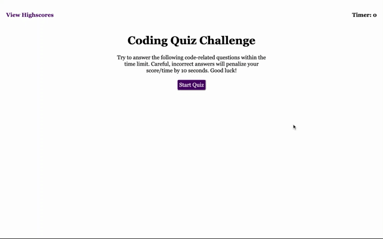

# CodeQuiz

## Description
The purpose of this project is to create an interactive quiz to test a user's coding knowledge and also show how they compare to previous attempts.

This quiz demonstrates how we can use JavaScript to create an interactive webpage that takes in user inputs and dynamically updates the webpage based on these inputs. A some highlights from the code include:

    🌎 Demonstration of page traversing using the DOM
    📦 Use of local storage to store user scores
    🔈 Event Listeners for user clicks and inputs
    🎡 Plenty of loops and if/else statements
    💎 Adding/removing elements and attributes based on the user's input

## Demo

## Check it out!
👉 [Link to the Application](https://mel-ificent.github.io/CodeQuiz/)